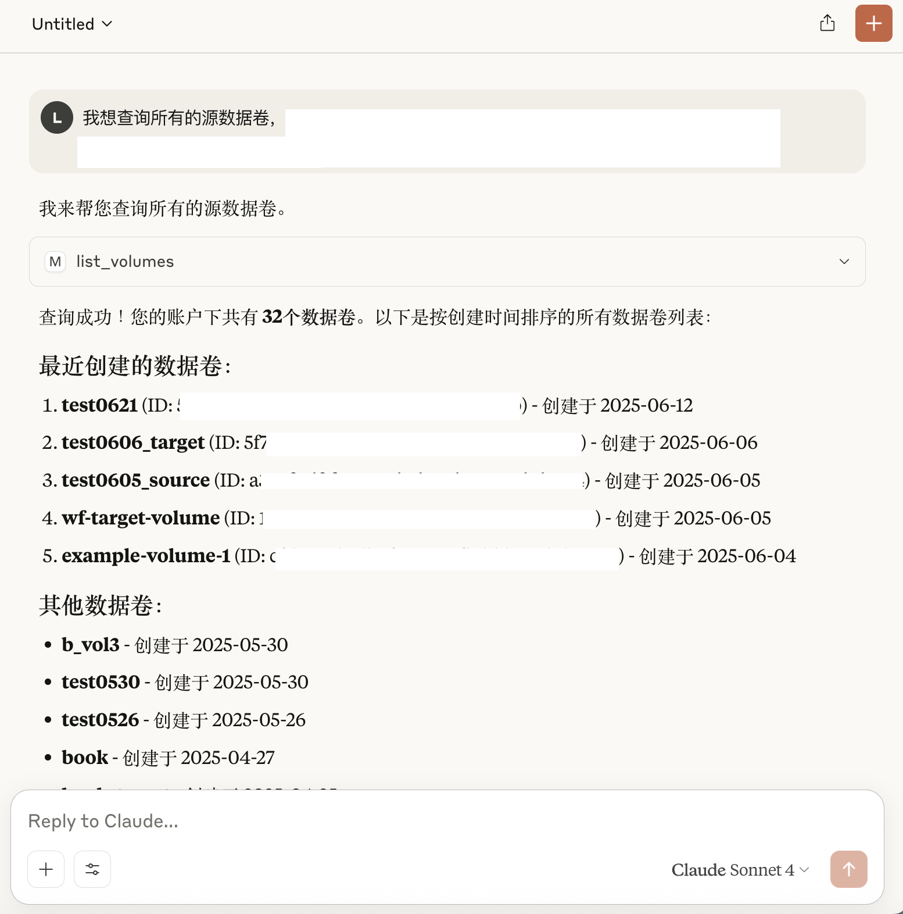

# MOI MCP 快速使用指南

## 什么是 MOI MCP？

MOI MCP（MatrixOne Intelligence Model Context Protocol）是 MatrixOne Intelligence 提供的智能服务接口，让 AI 助手可以直接使用 MOI 平台的各种数据处理和分析功能。

**MOI MCP 主要功能：**

- **创建连接器** - 连接各种数据源（数据库、文件、API 等）
- **载入数据** - 从不同数据源导入和处理数据
- **创建工作流** - 构建自动化的数据处理流程
- **获取解析后的数据** - 获取经过 AI 处理和分析的结构化数据

## 可用工具

MOI MCP 提供了丰富的工具来满足不同的数据处理需求。以下是所有可用工具的详细说明：

### 原始数据卷管理

- **CreateOriginVolume** - 创建原始数据卷
- **DescribeOriginVolume** - 获取指定原始数据卷的详细信息
- **DescribeOriginVolumes** - 列出所有原始数据卷
- **DeleteOriginVolumeFiles** - 删除原始数据卷中的文件
- **GetOriginVolumeFileLink** - 获取原始数据卷文件的访问链接

### 连接器管理

- **CreateConnector** - 创建新的数据连接器
- **ListConnectors** - 列出所有可用的连接器
- **UpdateConnector** - 更新连接器配置
- **ListConnectorFiles** - 列出连接器中的文件

### 数据加载任务

- **CreateLoadTask** - 创建数据加载任务
- **ListLoadTasks** - 列出所有数据加载任务

### 工作流管理

- **CreateWorkflowMeta** - 创建工作流
- **ListWorkflowMetas** - 列出所有工作流
- **GetWorkflowMeta** - 获取指定工作流
- **DeleteWorkflowMeta** - 删除工作流

### 🌿 工作流分支管理

- **CreateWorkflowBranch** - 创建工作流分支
- **ListWorkflowBranches** - 列出所有工作流分支
- **GetWorkflowBranch** - 获取指定工作流分支信息
- **UpdateWorkflowBranch** - 更新工作流分支
- **DeleteWorkflowBranch** - 删除工作流分支
- **EnableWorkflowBranch** - 启用工作流分支
- **DisableWorkflowBranch** - 禁用工作流分支

### 处理后数据管理

- **ListProcessedVolumes** - 列出所有处理后的数据卷
- **CreateProcessedVolume** - 创建处理后的数据卷
- **ListBranchedVolumes** - 列出分支数据卷

### 文件管理

- **ListVolumeFiles** - 列出数据卷中的文件
- **DeleteVolumeFile** - 删除数据卷中的文件
- **ListFileBlocks** - 列出文件块信息
- **DeleteFileBlocks** - 删除文件块

> 💡 **使用提示**：这些工具可以通过自然语言调用，AI 助手会自动选择合适的工具来完成您的请求。

## 1. MCP 配置

1. 进入您的 MCP 客户端（Cursor、Claude 等）设置，找到配置 MCP 服务器的地方（不同客户端位置可能不同）

2. 注册新的 MCP 服务器，在 `mcpServers` 下添加 "moi" 配置块，配置内容如下：

```json
{
  "mcpServers": {
    "mcp-moi-server": {
      "type": "streamable-http",
      "url": "https://mcp.m1intelligence.cn/mcp/",
      "note": "For Streamable HTTP connections, add this URL directly in your MCP Client",
      "headers": {
        "moi-key": "<your-api-key>"
      }
    }
  }
}
```

3. 保存配置文件后，**退出客户端并重新进入**，使配置生效

## 2. 获取 API Key

1. 访问 MatrixOne Intelligence 控制台
2. 进入 API 管理页面
3. 创建新的 API Key
4. 复制密钥并更新配置文件中的 `<your-api-key>`
5. 重启 AI 客户端

> 💡 **详细说明**：关于 API Key 的创建和管理，请参考 [API Key 管理文档](../workflow%20api/token_api.md#api-key-管理)

## 开始使用

完成上述两个步骤后，就可以在对话中使用 MOI MCP 功能了：


